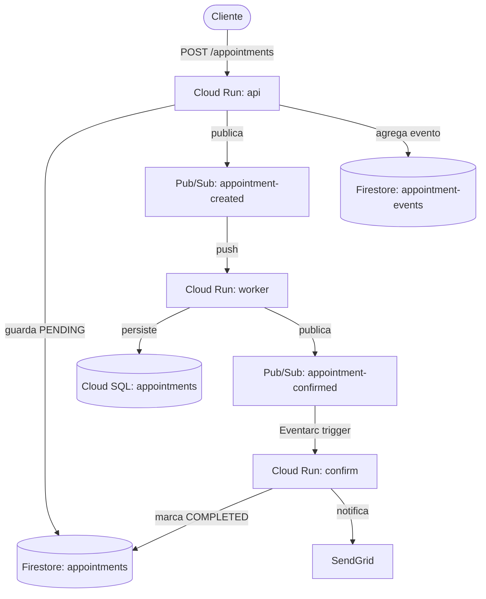

[](https://github.com/apchavez/gcp-go/actions/workflows/ci.yml)
[](https://sonarcloud.io/summary/new_code?id=apchavez_gcp-go)
[](https://sonarcloud.io/summary/new_code?id=apchavez_gcp-go)

# Plataforma de Agendamiento de Citas Médicas — GCP

Plataforma backend para agendamiento de citas médicas construida con **Go** y **Google Cloud Platform**, usando Clean Architecture.

Este es el **tercer hermano** del mismo dominio de agendamiento de citas, junto a:

| Proyecto | Cloud / Lenguaje |
|---|---|
| [aws-typescript](https://github.com/apchavez/aws-typescript) | AWS Lambda / TypeScript |
| [azure-python](https://github.com/apchavez/azure-python) | Azure Functions / Python |
| **gcp-go** (este repo) | GCP Cloud Run / Go |

Mismo dominio de negocio, mismos 4 endpoints, mismas reglas de autorización por titularidad del asegurado, y los mismos números de JWT hecho a mano (HS256) y resiliencia retry/circuit-breaker que sus dos hermanos — solo cambian el cloud y el lenguaje, a propósito, para demostrar que las mismas capacidades de ingeniería son portables entre ecosistemas.

Fue desplegado en vivo a un proyecto real de GCP (Cloud Run + Firestore + Pub/Sub + Cloud SQL) y probado de punta a punta — crear, obtener historial, y listado paginado fueron verificados contra la API desplegada — y luego destruido vía `destroy.yml` para evitar costo ocioso. `deploy.yml` vuelve a desplegar el mismo stack bajo demanda con una corrida manual.

> **Costo cero en reposo** — el CI solo compila y corre pruebas. No se aprovisiona ningún recurso de GCP hasta que se dispara manualmente el workflow de deploy.

---

## Stack Tecnológico

| Capa | Tecnología |
|---|---|
| Lenguaje | Go 1.25 |
| Runtime | GCP Cloud Run (3 servicios: `api`, `worker`, `confirm`) |
| Router de API | `net/http` + `chi` |
| Gateway / quota | GCP API Gateway (equivalente a AWS API Gateway throttle / Azure API Management) — quota de 1500 req/min por proyecto (~25 rps sostenido), delante del servicio `api`; el acceso directo a Cloud Run se conserva |
| Almacén de estado | Firestore (modo Native) — colecciones `appointments` + `appointment-events` |
| Almacén relacional | Cloud SQL para PostgreSQL (solo citas finales/completadas, montado en `worker` vía el conector nativo de Cloud Run) |
| Mensajería | Pub/Sub (tópico `appointment-created`, una suscripción push compartida) |
| Bus de eventos | Eventarc (equivalente a EventBridge/Event Grid) — enruta el tópico `appointment-confirmed` al servicio `confirm` |
| Notificaciones | SendGrid (best-effort; no-op si no está configurado) |
| Observabilidad | Cloud Trace vía OpenTelemetry (equivalente a X-Ray/Application Insights) — spans HTTP en los 3 servicios Cloud Run + spans por cada llamada a Firestore/Pub-Sub/Cloud SQL |
| Auth | JWT HS256 hecho a mano, autorización por titularidad del asegurado |
| Resiliencia | Retry + circuit breaker hecho a mano (3 intentos, backoff 100/200/400ms, ventana de 10 llamadas, umbral 50%, 30s abierto, 3 sondas half-open) |
| IaC | Terraform |
| Testing | `testing` de Go + `testify`, tests table-driven |
| Docs | OpenAPI 3.1 |

## Arquitectura


```mermaid
flowchart TD
    Client([Cliente]) -->|POST /appointments| API[Cloud Run: api]
    API -->|guarda PENDING| FS[(Firestore: appointments)]
    API -->|publica| PS[Pub/Sub: appointment-created]
    API -->|agrega evento| FSE[(Firestore: appointment-events)]
    PS -->|push| W[Cloud Run: worker]
    W -->|persiste| SQL[(Cloud SQL: appointments)]
    W -->|publica| PSC[Pub/Sub: appointment-confirmed]
    PSC -->|Eventarc trigger| C[Cloud Run: confirm]
    C -->|marca COMPLETED| FS
    C -->|notifica| SG[SendGrid]
```

El flujo de confirmación se divide en dos etapas separadas — igual que el hermano AWS (countryWorker λ → EventBridge → SQS → confirmAppointment λ): `worker` (etapa A) persiste en Cloud SQL y publica un evento; un **trigger de Eventarc** (no una suscripción push directa) enruta ese evento al servicio `confirm` (etapa B), que marca la cita COMPLETED en Firestore y notifica. Eventarc es el servicio de GCP más equivalente a EventBridge/Event Grid — un bus de eventos gestionado con enrutamiento, en vez de una suscripción Pub/Sub directa.

### Gateway y quota

Delante del servicio `api` corre un **GCP API Gateway** (`terraform/api_gateway.tf`, spec `terraform/api-gateway-openapi.yaml.tftpl`) con una quota de proyecto de 1500 solicitudes/minuto (equivalente a los 25 rps sostenidos del throttle de AWS API Gateway) — mismo rol que la política `rate-limit-by-key` de Azure API Management. Matiz técnico real: Cloud Endpoints/API Gateway impone quotas por ventana de minuto, sin un concepto de "burst" separado como el token bucket de AWS (burst 50 / rate 25 rps) — se documenta la aproximación en vez de ocultarla. El servicio Cloud Run `api` sigue siendo accesible directo (tests, CI y Postman le pegan directo); el Gateway es la ruta adicional recomendada, no un reemplazo.

### Observabilidad

Los 3 servicios Cloud Run (`api`, `worker`, `confirm`) exportan spans a **Cloud Trace** vía OpenTelemetry (`internal/infrastructure/tracing`) — el equivalente en GCP de X-Ray (AWS) / Application Insights (Azure). Cada request HTTP y cada llamada a Firestore, Pub/Sub o Cloud SQL genera su propio span (instrumentado una sola vez, en el wrapper `resilience.Resilience.Run` que ya envuelve todas esas llamadas, no en cada call site individual). Cloud Run también envía logs a Cloud Logging automáticamente sin código adicional.

El backend sigue **Clean Architecture / Hexagonal (Ports & Adapters)**:

```
gcp-go/
├── cmd/
│   ├── api/            Entrypoint de la API HTTP (servicio Cloud Run)
│   ├── worker/         Etapa A: suscripción push de Pub/Sub → persiste en Cloud SQL → publica confirmación (servicio Cloud Run separado)
│   └── confirm/        Etapa B: trigger de Eventarc → marca COMPLETED en Firestore + notifica (servicio Cloud Run separado)
├── internal/
│   ├── domain/          Appointment, AppointmentEvent, ports (interfaces), errores de dominio
│   ├── application/     AppointmentService — los casos de uso (incluye Persist/Complete, las 2 etapas de confirmación)
│   ├── infrastructure/
│   │   ├── auth/         verificación/firma de JWT hecha a mano + guard de auth
│   │   ├── resilience/   retry + circuit breaker hecho a mano
│   │   ├── repos/        repo de estado en Firestore, event store en Firestore, repo en Cloud SQL
│   │   ├── messaging/    publishers de Pub/Sub (created/confirmed) + handlers push del worker y de Eventarc del confirm
│   │   ├── notifications/ notificador de SendGrid + fallback no-op
│   │   ├── noop/         stubs no-op de los ports que cada binario (api/worker/confirm) no ejercita
│   │   └── tracing/      OpenTelemetry → Cloud Trace, compartido por los 3 binarios
│   ├── api/              capa de handlers HTTP (routing, validación, auth, mapeo de errores)
│   └── shared/           helpers de respuesta HTTP, estado de salud
├── db/migration/        esquema de Cloud SQL
├── terraform/           Cloud Run, Firestore, Pub/Sub, Eventarc, Cloud Trace, Cloud SQL, Secret Manager, API Gateway, IAM
├── api/openapi.yaml      especificación OpenAPI 3.1
└── postman/              colección de Postman + environments
```

## API

| Método | Ruta | Descripción |
|---|---|---|
| POST | `/appointments` | Crea una nueva cita (estado `pending`) |
| GET | `/appointments/{insuredId}` | Lista citas por asegurado, paginado (`pageSize`, `cursor`) |
| GET | `/appointments/{appointmentUuid}/history` | Historial completo de eventos de una cita |
| GET | `/health` | Health check (anónimo) |

Especificación completa: [`api/openapi.yaml`](api/openapi.yaml).

### Autorización

Token Bearer JWT, `HS256`, claims `{sub, role, iat, exp}`. El rol `insured` solo puede actuar sobre su propio `insuredId` (comparado contra `sub`); el rol `agent` no tiene restricción. Esto se aplica de forma idéntica en los endpoints que reciben un identificador de cita/asegurado, incluyendo `GET .../history` — que primero busca la cita para verificar titularidad, en vez de derivar el dueño a partir del primer evento (un detalle sutil que de hecho fue un bug real en los handlers de historial de Java/Python de este dominio, corregido en esta sesión).

## Desarrollo local

```bash
export GCP_PROJECT_ID=your-project
export JWT_SECRET=local-dev-secret
go run ./cmd/api
```

Requiere Application Default Credentials (`gcloud auth application-default login`) para acceso a Firestore/Pub/Sub cuando se corre contra recursos reales de GCP, o apuntar a los emuladores de Firestore/Pub/Sub para desarrollo completamente offline.

## Testing

```bash
go test ./... -race -coverprofile=coverage.out
go vet ./...
golangci-lint run ./...
```

**34 tests en 6 archivos de test.** Las capas de dominio + aplicación tienen un gate de cobertura del 80% (refleja los gates de JaCoCo/pytest-cov de los hermanos AWS/Azure); los adaptadores de infraestructura están testeados pero no tienen gate, ya que envuelven clientes reales del SDK de GCP (excepción: el handler HTTP del servicio `confirm` sí tiene tests, al ser lógica pura de parseo/despacho, no un wrapper de SDK).

## Infraestructura

`terraform/` provisiona: 3 servicios Cloud Run (api, worker, confirm), Firestore (modo Native) con índices compuestos, Pub/Sub (tópico `appointment-created` + 1 suscripción push compartida + tópico dead-letter, y tópico `appointment-confirmed`), un trigger de Eventarc (enruta `appointment-confirmed` → `confirm`), Cloud SQL para PostgreSQL (montado en `worker` vía el volumen nativo `cloud_sql_instance` de Cloud Run v2), Secret Manager (secreto JWT, key de SendGrid, password de Cloud SQL), y una service account dedicada con bindings IAM de mínimo privilegio (incluye `roles/eventarc.eventReceiver` para el trigger).

El CI de este repo no provisiona ningún proyecto GCP en vivo — `deploy.yml`/`destroy.yml` son solo `workflow_dispatch` y requieren credenciales de GCP configuradas como secretos del repositorio.

`cost-guard.yml` corre diariamente (06:00 UTC), sin necesidad de activarlo manualmente — revisa el timestamp de creación del servicio Cloud Run `api`, y si tiene más de 48h (configurable vía `max_age_hours` en una corrida manual), dispara `destroy.yml` él mismo vía la API de GitHub. No hace nada si no hay nada desplegado. Existe para que un deploy de demostración nunca siga facturando en silencio días después.

Ciclo completo deploy→smoke test→destroy verificado en vivo el 2026-07-15: `deploy.yml` aprovisiona Cloud Run (api+worker+confirm), Cloud SQL, Pub/Sub, Eventarc, Secret Manager y Firestore, corre un smoke test real (`/health` y un endpoint autenticado con JWT firmado en el propio job) contra la URL desplegada, y `destroy.yml` deja confirmado cero recursos facturables — incluyendo las imágenes gcr.io, cuya limpieza requiere que la service account del deployer (`github-deployer@clinic-scheduling-gcp-dev.iam.gserviceaccount.com`) tenga `roles/datastore.owner` y `roles/artifactregistry.repoAdmin` a nivel de proyecto (otorgados el 2026-07-15; sin esos dos roles, `terraform apply` falla al crear Firestore y `destroy.yml` deja hasta 2 imágenes huérfanas de costo despreciable). La base Firestore `(default)` no se puede eliminar vía API una vez creada (solo deshabilitar) — `deploy.yml` la reimporta al estado de Terraform en cada corrida en vez de intentar recrearla.

`integration.yml` (manual, `workflow_dispatch`) corre la colección de Postman vía Newman más los tests de carga de k6 (`tests/load/appointments.js`) contra un `base_url` real ya desplegado — genera un JWT de prueba HS256 firmado con el secret `JWT_SECRET` del repositorio, mismo patrón que los hermanos `aws-typescript`/`azure-python`.

**Design note:** ni Firestore, ni Cloud SQL, ni Secret Manager tienen una clave CMEK (customer-managed encryption key) propia en `terraform/` — los tres dependen del cifrado en reposo por defecto de Google. Suficiente para una demo de portafolio; una CMEK real requeriría un keyring de Cloud KMS más un binding de IAM (`roles/cloudkms.cryptoKeyEncrypterDecrypter`) por recurso, no es un flag de una línea.

## Proyectos Relacionados

Este repo hace pareja con **aws-typescript** y **azure-python**: los tres implementan el mismo dominio de agendamiento de citas y Clean Architecture, los mismos 4 endpoints, distinto cloud/lenguaje — mantenidos en paridad funcional a propósito. Los cuatro proyectos fullstack de Kubernetes forman un segundo grupo así, compartiendo un dominio de Gestión de Productos en su lugar.

| Proyecto | Descripción |
|---|---|
| [aws-typescript](https://github.com/apchavez/aws-typescript) | La versión original en AWS — TypeScript, Lambda, DynamoDB, SNS/SQS. Misma lógica de dominio, distinto cloud |
| [azure-python](https://github.com/apchavez/azure-python) | Migración a Azure de esta plataforma — mismo dominio y Clean Architecture, reescrito en **Python** sobre Azure Functions, Cosmos DB, y Service Bus |
| [quarkus-react](https://github.com/apchavez/quarkus-react) | Plataforma de Gestión de Productos — backend Quarkus, frontend React, MongoDB, Redis, eventos Kafka, Kubernetes |
| [spring-webflux-angular](https://github.com/apchavez/spring-webflux-angular) | Mismo dominio de Gestión de Productos que arriba, backend reactivo Spring Boot WebFlux, frontend Angular, PostgreSQL, Kafka, Kubernetes |
| [spring-mvc-angular](https://github.com/apchavez/spring-mvc-angular) | Mismo dominio de Gestión de Productos y frontend Angular que spring-webflux-angular, backend clásico bloqueante Spring MVC, Spring Data JDBC, Kafka, Kubernetes |
| [net-vue](https://github.com/apchavez/net-vue) | Mismo dominio de Gestión de Productos, backend ASP.NET Core, frontend Vue 3, PostgreSQL, Kafka, Kubernetes |

## Qué Demuestra Este Proyecto

- Límites de Clean Architecture / hexagonal en Go idiomático (interfaces como ports, sin magia de framework)
- Una tercera implementación independiente del mismo dominio de agendamiento de citas orientado a eventos, probando que el diseño se traduce entre AWS, Azure, y GCP
- Verificación de JWT hecha a mano y una implementación de resiliencia hecha a mano (retry + circuit breaker), portada con parámetros idénticos entre 3 lenguajes
- Patrones cloud-native de GCP: Firestore para estado rápido + event sourcing, un único worker Pub/Sub→Cloud Run, Cloud SQL para el lado relacional durable, Eventarc como bus de eventos gestionado (equivalente a EventBridge/Event Grid) desacoplando el paso de persistencia relacional del de notificación, Secret Manager + IAM de mínimo privilegio
- IaC con Terraform, CI con GitHub Actions con un gate de cobertura acotado, contrato documentado con OpenAPI, y una colección de Postman mantenida en sincronía con los proyectos hermanos
